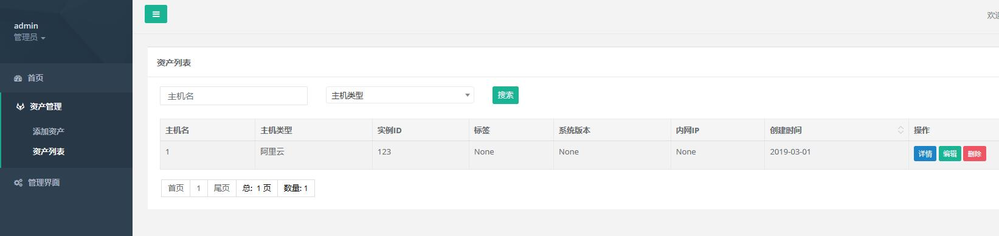
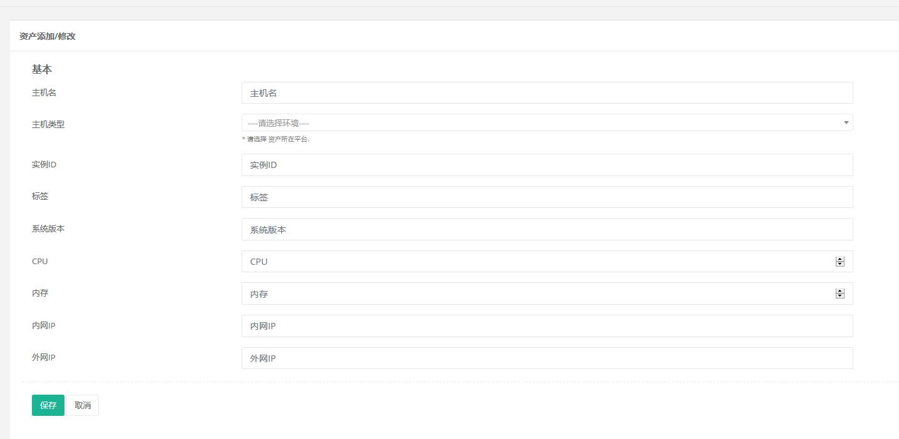
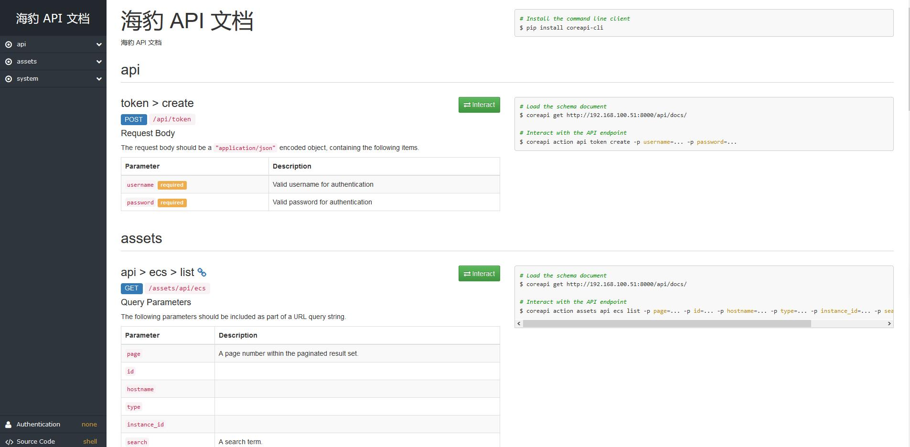
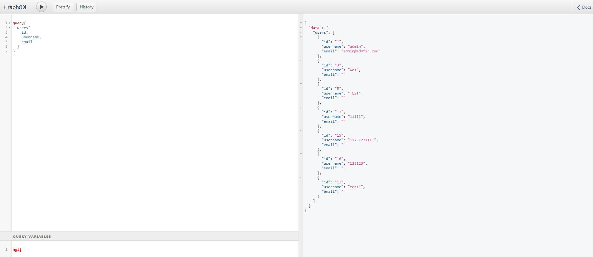
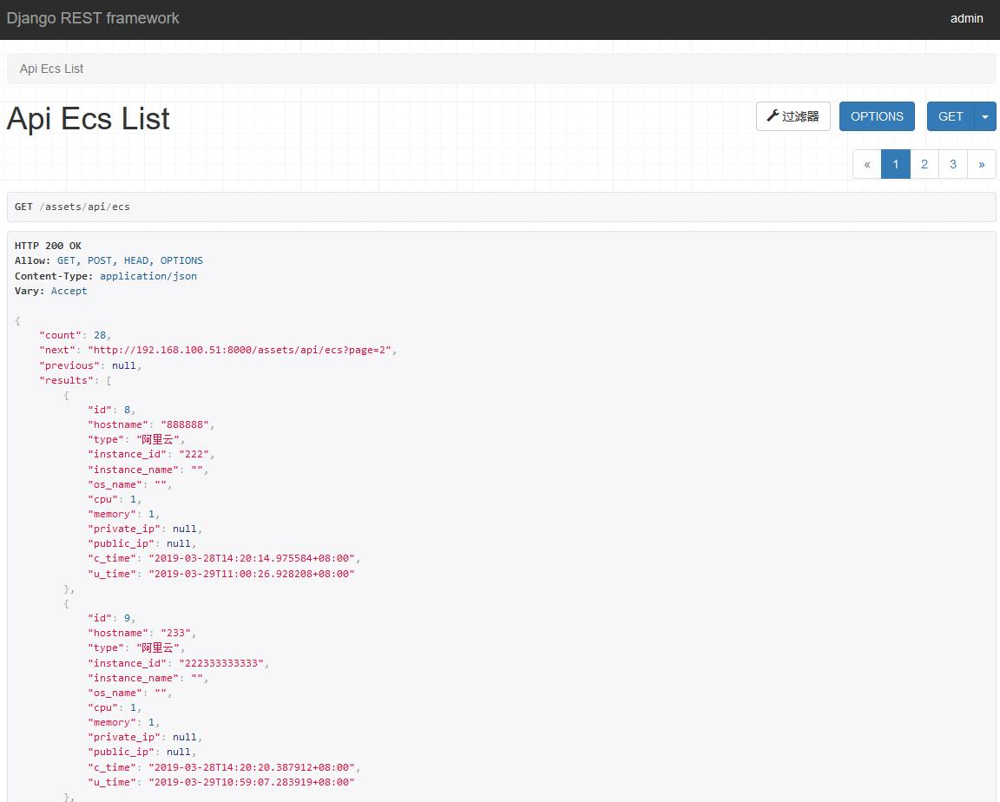
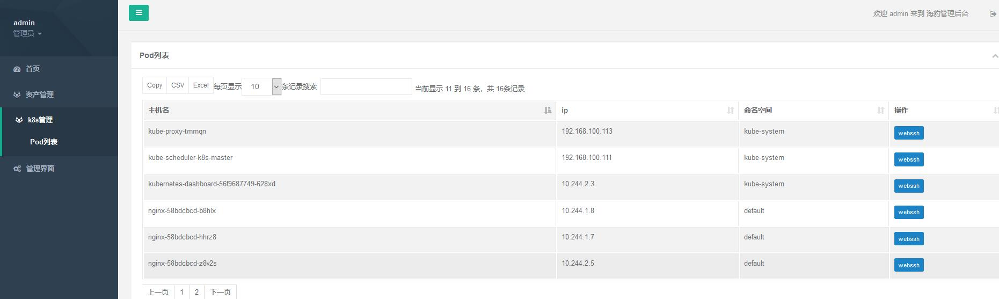
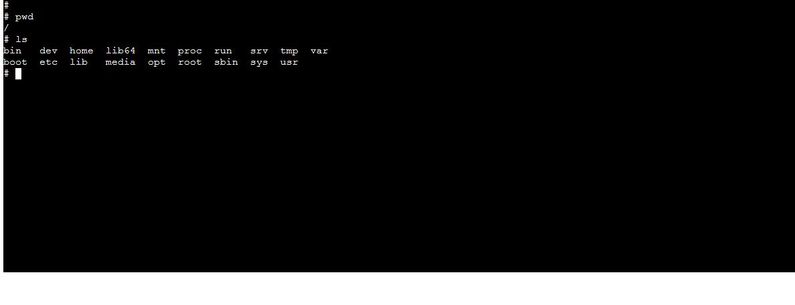
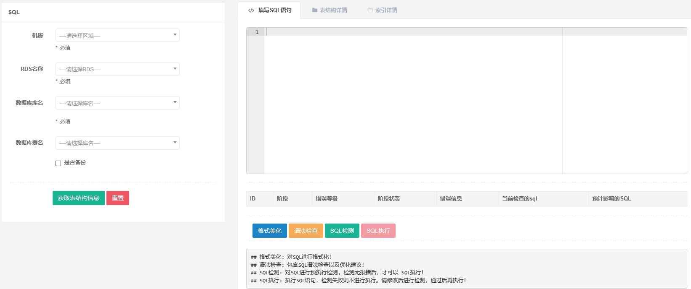

# 海豹  


> django-base-templates

> 因本项目开始时间为3月1日,是 国际海豹日,故项目起名为  海豹 seal 

> 主要为 django 基础开发平台, MVC 模式 开发.支持 非前后端分离 和 前后端分离模式,可以拿来参考 开发 django项目

> 支持 RESTful 和 GraphQL

> vue 前端地址 <https://github.com/hequan2017/seal-vue> 持续开发中

> 作者会在周末进行开发、更新。

> 支持 k8s webssh 管理 pod！ sql执行 ！

 
## 介绍
* 基于bootstrap3+django2.2 + python3.6+celery4 异步任务
* 前端模板 inspinia 2.7 
* 采用cbv开发方式
* drf  RESTful  api 例子
* 前端 Vue版本
* GraphQL
* k8s管理  
* sql执行 引擎  goInception / soar


## 开发计划

*  一期: 基础模板 (已完成)
*  二期: k8s管理平台 (开发中)
    * node/service/pod   列表   (已完成)  
    * pod   webssh (已完成， 通过调用 k8s api 进行执行命令)  
*  三期: mysql sql语句审核(已完成)
    * sql检测执行
 
    
    
## DEMO

> http://129.28.156.219:8001

> 账户 admin    密码 1qaz.2wsx

> api文档地址 : http://129.28.156.219:8001/api/docs/











## templates

* base      网页基本模板
* system    平台基本网页(首页/登录/修改密码)
* assets    资产管理  (增删改查例子)
* document  代码规范


## GraphQL
> 具体代码 请参考  seal/schema.py

> 请求地址 :  <http://localhost/graphql>

> GraphQL 请求参数
```
query{
  users{
    id,
    username,
    email
  }
}

query{
  singleUser(pk: 1){
    username,
    email
  }
}

mutation createUser {
 createUser (username: "test1") {
     info {
         id,
     },
     ok
 }
}

mutation updateUser {
 updateUser (pk:2,username: "test2") {
     info {
         id,
     },
     ok
 }
}

mutation deleteUser {
 deleteUser (pk:2) {
     ok
 }
}
```


## 部署
* mysql 5.7 / sqlite
* redis

```bash
yum install  python-devel mysql-devel  python36-devel.x86_64  -y

git clone https://github.com/hequan2017/seal
cd seal

## django 2.2 不支持 低版本的 sqlite,如果想使用sqlite  存储数据 ，请根据这个博客 https://www.jianshu.com/p/cdacf4b74646 进行升级

python36  -m  pip  install -r requirements.txt
python36 manage.py makemigrations
python36 manage.py migrate
python36 manage.py createsuperuser


python36  manage.py  runserver 0.0.0.0:8001

//
nohup  python36  manage.py  runserver 0.0.0.0:8001  >>  /tmp/http.log   2>&1  & 


```

## k8s模块

> 修改settings  k8s 相关设置
```
## K8S
Token = "eyJhbGciOiJSUzI1NiIsImtpZCI6IiJ9.eyJpc3MiOiJrdWJlcm5ldGVzL3NlcnZpY2VhY2NvdW50Iiwia3ViZXJuZXRlcy5pby9zZXJ2aWNlYWNjb3VudC9uYW1lc3BhY2UiOiJrdWJlLXN5c3RlbSIsImt1YmVybmV0ZXMuaW8vc2VydmljZWFjY291bnQvc2VjcmV0Lm5hbWUiOiJkYXNoYm9hcmQtYWRtaW4tdG9rZW4tZGhobWMiLCJrdWJlcm5ldGVzLmlvL3NlcnZpY2VhY2NvdW50L3NlcnZpY2UtYWNjb3VudC5uYW1lIjoiZGFzaGJvYXJkLWFkbWluIiwia3ViZXJuZXRlcy5pby9zZXJ2aWNlYWNjb3VudC9zZXJ2aWNlLWFjY291bnQudWlkIjoiOThkMDcwZWItODc1Yy0xMWU5LWE1MzgtMDAwYzI5N2I0ZmU3Iiwic3ViIjoic3lzdGVtOnNlcnZpY2VhY2NvdW50Omt1YmUtc3lzdGVtOmRhc2hib2FyZC1hZG1pbiJ9.XDFpez2E84R_zlopt_uEHPvVGUtSavypyix6UcYJO3J4imHdJy7MEkfV-wltBA1H8x0TT2AW64rLlXaRJ8OkFWJ0myedfKdjnf7i0oLQ8j-7lw6rT3A0e2pKmpnOaBQfgzRm83-t2I5MMp3Iu9VNUiAbqQpjql4AKwRuJEEGCs99tKStUxzIsJKusmUHh9KAK4BAxySn9h16T2URZ7czLP4mty2crYWNV4KwSwFPthGhFPsl8mnet_hiV5k4me5a8frmXytOy64MmGW8w3TBgiM-7hBYSxt84QGGnyi84LU0EFgtLwBWEOTZeUKKQ6IkoAprMmNcSxX8WUJFlx_uJg"
APISERVER = 'https://192.168.100.111:6443'
```


## SQL模块

> 进入项目 cd  seal

> sql/bin/config/config.toml 里面可以设置备份服务器，详情可以  github搜索   goInception
```
chmod +x sql/bin/soar

chmod +x sql/bin/goInception

./sql/bin/goInception -config=sql/bin/config/config.toml
```


## 异步任务


* 扩展功能-异步1   推荐 定时任务用celery

```bash

cd seal
celery  -B   -A  seal  worker  -l  info
```

* 扩展功能-异步2   普通异步任务 用  dramatiq
```bash
cd system/decorator/asynchronous/
dramatiq  asynchronous  --watch  .  --log-file  /tmp/dramatiq.log

```


##  注意
* 如果想直接拿来做生产项目,请重新生成一个 settings 文件里面的 SECRET_KEY 
* 时区问题
```python
##因为开启了时区,所以django在数据库里面保存的为 utc 时间, 调用的时候会帮你 转为 东八区, celery会自动识别时间
from django.utils import timezone
for i in Users.objects.all():
    print(i.last_login)  ## 直接读取时间,会是 utc时间,未转换, 如果需要处理 请注意
    print(timezone.localtime(i.last_login).strftime("%Y-%m-%d %H:%M:%S"))  ## 时间格式化为 正常时间
    
## 2019-03-05 06:41:18.040809+00:00
## 2019-03-05 14:41:18

```


## 售后服务

* cbv 中文文档  <http://ccbv.co.uk/projects/Django/2.1/django.views.generic.edit/>
* GraphQL   中文参考文档  <https://passwo.gitbook.io/graphql/index/drf>

### 其他
* 有问题 可以加QQ群： 620176501  <a target="_blank" href="//shang.qq.com/wpa/qunwpa?idkey=bbe5716e8bd2075cb27029bd5dd97e22fc4d83c0f61291f47ed3ed6a4195b024"></a>
* 欢迎提出你的需求和意见,或者来加入到本项目中一起开发。

### 作者
* 何全 

