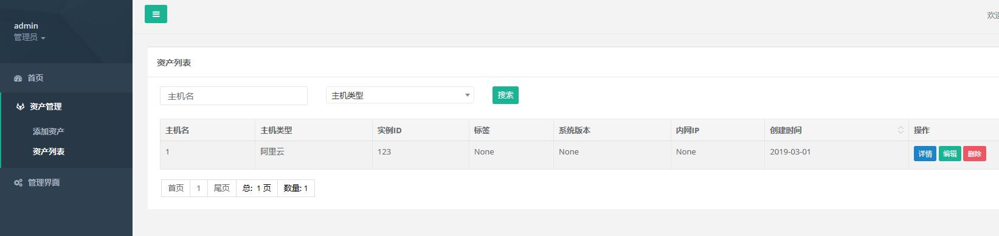
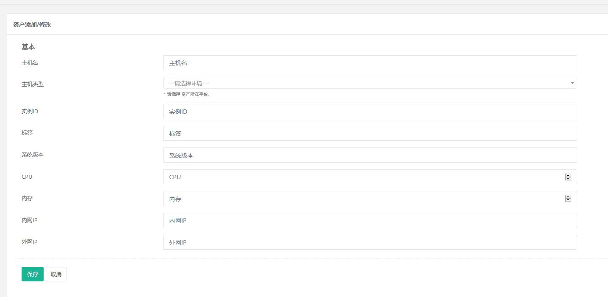
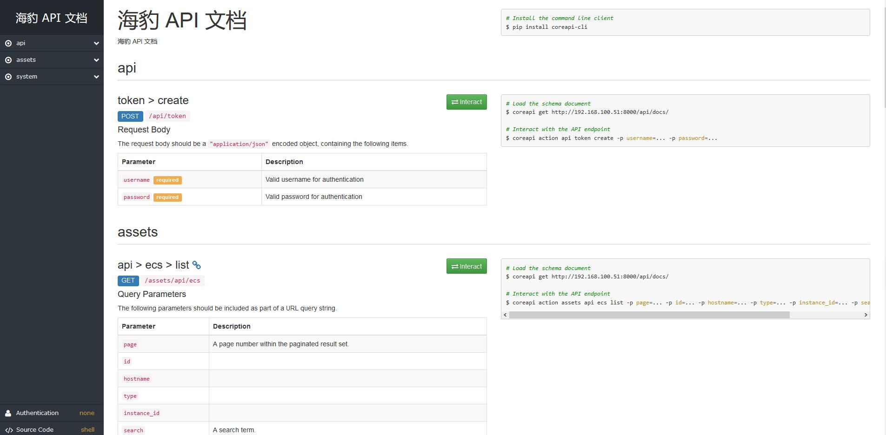
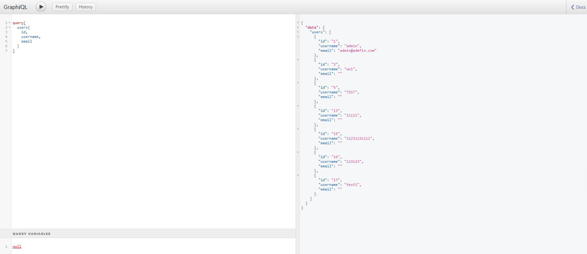
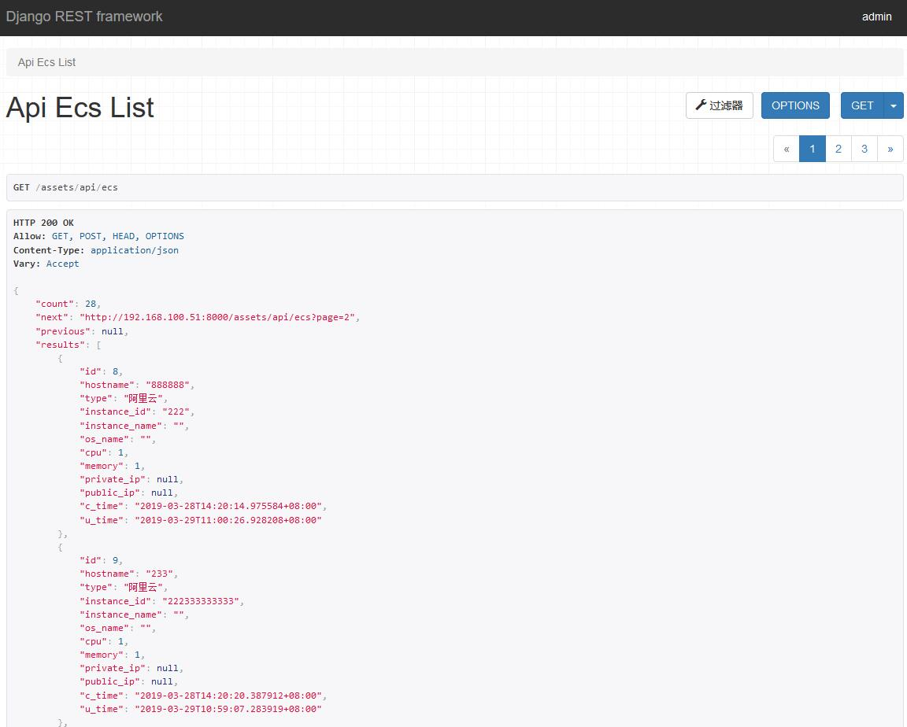
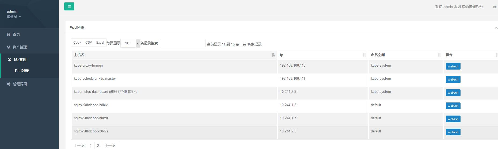
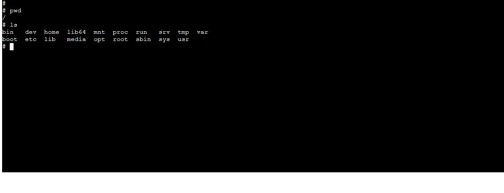
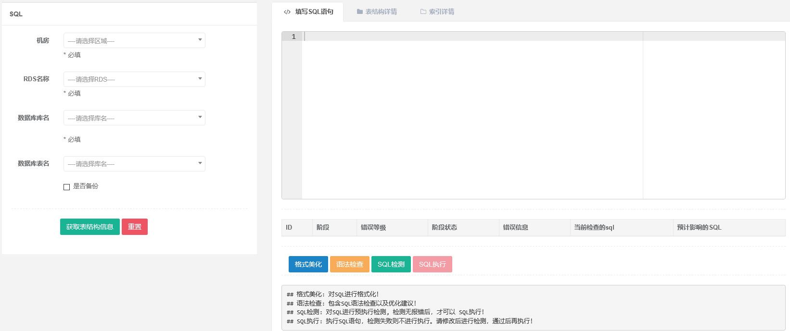

[简体中文](README.md) | [English](README.en.md)

# 海豹 seal

> django-base-templates —— 主要为 Django 开发 DEMO，支持非前后端分离和前后端分离模式


> 因本项目开始时间为 3 月 1 日，是国际海豹日，故项目起名为 海豹 seal。

## 项目介绍

海豹（seal）是一个 Django 基础开发平台模板，采用 MVC 模式开发，同时支持 **非前后端分离**（Django 模板渲染）和 **前后端分离**（RESTful / GraphQL API）两种开发方式，可以直接拿来参考开发自己的 Django 项目。

项目基于 Django 2.2 + Python 3.6 + Celery 4 异步任务，前端模板使用 inspinia 2.7（Bootstrap3），全部采用 CBV（Class-Based View）方式开发，并附带 DRF RESTful API 示例、GraphQL 示例、Kubernetes 管理和 SQL 审核执行等实战模块。

除了作为基础模板，项目还内置了两个运维场景的完整实现：**K8s Web Console**（Node / Service / Pod 列表 + Pod WebSSH，通过调用 k8s api 执行命令）和 **SQL 审核执行引擎**（goInception / soar）。

作者会在周末进行开发、更新。

## ✨ 功能特性

- **基础开发模板**：base 网页基本模板 + system 平台基本网页（首页 / 登录 / 修改密码），前端模板 inspinia 2.7（Bootstrap3）
- **资产管理示例**：assets 模块提供完整的增删改查（CBV）范例，可作业务模块开发参考
- **RESTful API**：基于 DRF 的接口示例，支持 Token 认证（`/api/token`），自带两套 API 文档（`/api/docs/` 与 Swagger 风格的 `/api/docs2/`）
- **GraphQL**：基于 graphene-django 的 Query / Mutation 示例（用户列表、单查、增删改），内置 GraphiQL 调试页面（`/graphql/`）
- **K8s 管理**：Node / Service / Pod 列表、Pod 详情，**Pod WebSSH**（django-channels + WebSocket，通过调用 k8s api 在 Pod 内执行命令）
- **SQL 审核执行**：集成 goInception 做 SQL 检测 / 执行（支持备份），集成 soar 输出语法优化建议，支持多环境数据库配置
- **异步任务双方案**：Celery（推荐用于定时任务，配合 django-celery-beat / django-celery-results / flower）与 dramatiq（普通异步任务）
- **权限控制**：登录认证 + Django Permission 页面级权限校验，后台管理使用 django-simpleui 美化

## 开发计划

* 一期：基础模板（已完成）
* 二期：k8s 管理平台（开发中）
    * node/service/pod 列表（已完成）
    * pod webssh（已完成，通过调用 k8s api 进行执行命令）
* 三期：mysql sql 语句审核（已完成）
    * sql 检测执行
* 四期：正在开发中，重构前端 <https://github.com/hequan2017/seal-d2-admin>

## 🛠 技术栈

**后端**

- Python 3.6 / Django 2.2.4（CBV 开发方式）
- Django REST framework 3.9.2 + django-rest-swagger（API 与文档）
- graphene-django 2.2.0（GraphQL）
- celery 4.1.1 + django-celery-beat + django-celery-results + flower；dramatiq 1.5.0（异步任务）
- django-channels 2.2.0 + channels-redis（Pod WebSSH 的 WebSocket 通道）
- kubernetes 9.0.0（官方 k8s python client）、PyMySQL / mysqlclient、paramiko、psutil

**前端**

- Bootstrap3 + inspinia 2.7 模板（非前后端分离模式）
- Vue 版本前端：<https://github.com/hequan2017/seal-vue>、<https://github.com/hequan2017/seal-d2-admin>

**存储与依赖服务**

- MySQL 5.7 / SQLite
- Redis（celery / dramatiq / channels 的 broker 与 backend）

**SQL 审核工具**

- goInception / soar（可执行文件已随仓库提供，位于 `sql/bin/`）

## 🚀 快速开始

环境要求：Python 3.6、MySQL 5.7（或 SQLite）、Redis。

```bash
yum install python-devel mysql-devel python36-devel.x86_64 -y

git clone https://github.com/hequan2017/seal
cd seal

## django 2.2 不支持低版本的 sqlite，如果想使用 sqlite 存储数据，
## 请根据这个博客 https://www.jianshu.com/p/cdacf4b74646 进行升级

python36 -m pip install -r requirements.txt
python36 manage.py makemigrations
python36 manage.py migrate
python36 manage.py createsuperuser

python36 manage.py runserver 0.0.0.0:8001

// 后台运行
// nohup python36 manage.py runserver 0.0.0.0:8001 >> /tmp/http.log 2>&1 &
```

### K8s 模块

修改 `seal/settings.py` 中 k8s 相关设置（Token 获取方法见 `k8s/k8sApi/获取k8s admin token的方法.md`）：

```python
## K8S
Token = "<dashboard-admin-token>"
APISERVER = 'https://192.168.100.111:6443'
```

### SQL 模块

进入项目目录 `cd seal`，`sql/bin/config/config.toml` 里面可以设置备份服务器，详情可以 GitHub 搜索 goInception：

```bash
chmod +x sql/bin/soar
chmod +x sql/bin/goInception

./sql/bin/goInception -config=sql/bin/config/config.toml
```

### 异步任务

* 扩展功能-异步1：推荐定时任务用 celery

```bash
cd seal
celery -B -A seal worker -l info
```

* 扩展功能-异步2：普通异步任务用 dramatiq

```bash
cd system/decorator/asynchronous/
dramatiq asynchronous --watch . --log-file /tmp/dramatiq.log
```

### 注意

* 如果想直接拿来做生产项目，请重新生成一个 settings 文件里面的 SECRET_KEY
* 时区问题（因为开启了时区，Django 在数据库里面保存的是 UTC 时间，调用的时候会帮你转为东八区，celery 会自动识别时间）：

```python
from django.utils import timezone
for i in Users.objects.all():
    print(i.last_login)  ## 直接读取时间，会是 utc 时间，未转换，如果需要处理请注意
    print(timezone.localtime(i.last_login).strftime("%Y-%m-%d %H:%M:%S"))  ## 时间格式化为正常时间

## 2019-03-05 06:41:18.040809+00:00
## 2019-03-05 14:41:18
```

## 📁 目录结构

```
seal/
├── assets/      # 资产管理（增删改查示例）
├── k8s/         # K8s 管理（node/service/pod 列表、Pod 详情、webssh）
├── sql/         # SQL 审核执行（goInception / soar，bin 目录含可执行文件）
├── system/      # 系统模块（登录/用户/密码/异步任务示例）
├── document/    # demo 截图、sql 说明、代码规范
├── templates/   # 页面模板（base/system/assets/k8s/sql）
├── static/      # 静态资源（inspinia、ace、echarts、ueditor 等）
└── seal/        # 项目配置（settings / urls / schema / routing / celery）
```

## 📸 DEMO / 截图

> DEMO：<http://129.28.156.219:8001>

> 账户 admin　密码 1qaz.2wsx

> API 文档地址：<http://129.28.156.219:8001/api/docs/>










## 🔗 相关项目

* **seal-vue**：Vue 版本前端（持续开发中）：<https://github.com/hequan2017/seal-vue>
* **seal-d2-admin**：四期重构前端（D2Admin）：<https://github.com/hequan2017/seal-d2-admin>

## GraphQL 使用示例

具体代码请参考 `seal/schema.py`，请求地址：<http://localhost/graphql>

GraphQL 请求参数：

```
query{
  users{
    id,
    username,
    email
  }
}

query{
  singleUser(pk: 1){
    username,
    email
  }
}

mutation createUser {
 createUser (username: "test1") {
     info {
         id,
     },
     ok
 }
}

mutation updateUser {
 updateUser (pk:2,username: "test2") {
     info {
         id,
     },
     ok
 }
}

mutation deleteUser {
 deleteUser (pk:2) {
     ok
 }
}
```

## 📄 License

[MIT](LICENSE) © 2019 何全

## 售后服务

* cbv 中文文档 <http://ccbv.co.uk/projects/Django/2.1/django.views.generic.edit/>
* GraphQL 中文参考文档 <https://passwo.gitbook.io/graphql/index/drf>

### 交流

* 有问题可以加 QQ 群：620176501 <a target="_blank" href="//shang.qq.com/wpa/qunwpa?idkey=bbe5716e8bd2075cb27029bd5dd97e22fc4d83c0f61291f47ed3ed6a4195b024"></a>
* 欢迎提出你的需求和意见，或者来加入到本项目中一起开发。

### 作者

* 何全
